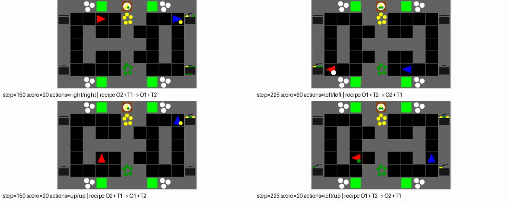
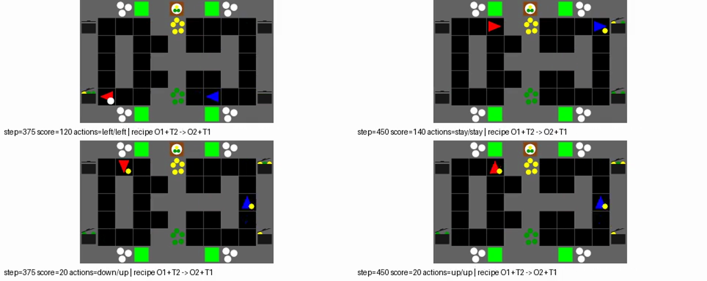

# `distance_10` 행동 점검 (진행 중)

`transition_observer=both`, 30M-step IPPO-CNN 10시드의 10×10 순서쌍을
각각 20회 평가했다. SP 평균은 148점, XP 평균은 120점으로 차이는
28점이다. SP 10쌍의 점수 분포는 120점 1쌍, 140점 7쌍, 180점
1쌍, 200점 1쌍이다. XP 90쌍 중 최저는 20점이고, 100점 이하가
32쌍이다. 따라서 평균 차이는 모든 XP 조합의 일관된 소폭 손실이라기보다
일부 파트너 조합의 큰 손실도 반영한다.

각 75스텝 페이즈의 평균 팀 보상은 다음과 같다. 순서쌍별 20회 평균을
구한 뒤 SP 또는 XP 순서쌍에 대해 다시 평균했다.

| 페이즈 | A0 | B1 | A2 | B3 | A4 | B5 |
|---|---:|---:|---:|---:|---:|---:|
| SP | 12.00 | 30.00 | 18.00 | 30.00 | 30.00 | 28.00 |
| XP | 12.00 | 23.56 | 20.67 | 20.89 | 23.33 | 19.56 |

초기 A 페이즈 평균은 같지만 이후 B 페이즈들에서 XP 손실이 크게
나타난다. 특히 `agent_0` 시드 7과 `agent_1` 시드 1의 XP는 20점으로,
결정적 평가의 첫 에피소드에서 B1에 한 번 배달한 뒤 남은 네 페이즈에
추가 배달이 없었다. 같은 시드 7의 SP는 140점이다. 이 결과는
파트너를 바꿨을 때 역할·조리 관습이 어긋날 수 있음을 시사한다.

같은 결정적 평가 시드 0으로 두 쌍을 재생했다. 아래 그림은 위 행이
SP `7+7`, 아래 행이 XP `7+1`이며, 왼쪽은 150스텝, 오른쪽은
225스텝이다. SP는 두 에이전트가 위쪽에서 아래쪽 경로로 함께 이동하며
20점에서 60점으로 올랐다. XP는 150스텝에 빨간 에이전트가 아래,
파란 에이전트가 위에 있었고, 225스텝까지 점수가 20점에 머물렀다.

영상의 삼각형 색을 이용해 각 스텝에서 위·아래 경로를 분류했다.
첫 페이즈 뒤 375스텝 동안 SP는 두 에이전트가 다른 경로에 있었던
프레임이 69/375개(18%)였고, XP는 색을 확인할 수 있었던 370개 중
321개(87%)였다. 마지막 B 페이즈의 XP에서는 75스텝 모두 빨간
에이전트가 위, 파란 에이전트가 아래에 있었다. SP는 마지막에
140점까지 배달했지만 XP는 20점에 머물렀다.

영상: [SP `7+7`](../../artifacts/layouts/distance10_search_0925/behavior/cnn_s7_sp.mp4),
[XP `7+1`](../../artifacts/layouts/distance10_search_0925/behavior/cnn_s7_xp.mp4).
따라서 이 조합에서는 **서로 다른 전달 경로를 유지하는 행동과 XP 배달
중단이 함께 관찰됐다**. 경로 불일치만의 인과 효과를 분리한 실험은
아니므로, 전체 10시드 갭의 유일한 원인이라고 주장하지 않는다.

출처: aica `distance10-priority-0925-cnn-full10/main/both/evaluation/cnn/distance_10`
아래 `summary.json`, `pair_results.json`, `adaptation_traces.json`.
IPPO-RNN/FCP 10시드와 FCP×IPPO 교차 평가는 진행 중이다.
