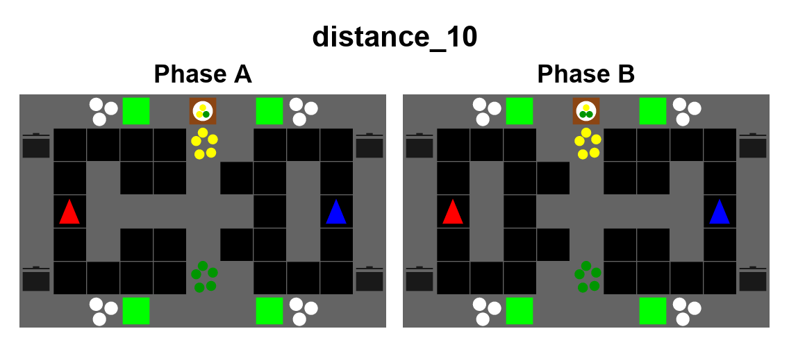

# `distance_10`: 상대의 전달 경로와 재료 우선순위를 함께 맞추기

0921 `distance_0` 10시드 평가에서 IPPO-CNN은 SP 170, XP 74.22,
IPPO-RNN은 SP 202, XP 102.44, FCP는 SP 184, XP 182였다. FCP 자체의
갭은 2점이지만 RNN의 SP가 FCP보다 18점 높아 합의한 두 번째 기준은
충족한다. 한편 사설 냄비를 둔 `distance_9`와 이를 `distance_0`으로
재학습한 맵에서는 FCP의 SP/XP가 같았다. 정책들이 서로 다른 선택을
하지 않으면 큰 우회 비용만으로는 XP 손실이 나타나지 않는다.

첫 `distance_10` 초안은 13×7 독립 조리 구역에서 페이즈마다 통로를
바꾸는 형태였다. 상대 행동 없이도 기존 루틴을 반복할 수 있다는
문제를 확인하여 **학습 전에 폐기했다**.

현재 후보는 11×7의 두 전달 경로와 경로별 사설 냄비를 유지한다.
위쪽 재료는 양파, 아래쪽은 토마토다. A 페이즈에서는 양파 2개·토마토
1개, B 페이즈에서는 양파 1개·토마토 2개를 요구한다. 공급자는 재료를
전달하고 받는 에이전트는 어느 냄비에 조리할지 선택한다. 상대가 선택한
경로와 다른 전달대를 택하면 역할 전환 뒤 긴 우회가 필요하다. 재료
우선순위도 동시에 반전되므로 두 에이전트가 경로와 재료 순서를 맞춰야 한다.

먼저 IPPO-CNN, IPPO-RNN, FCP 각각 4 learner seed를 30M 스텝
학습하고 4×4 순서쌍을 20회씩 평가한다. FCP population 6 seed도
별도로 새로 학습한다. 모든 실행은
`overcooked-v3-mapsearch-0925-d10-priority-pilot4-*` 프로젝트에
기록하고 기존 0921 프로젝트는 건드리지 않는다. 최종 10점 기준은
10시드 전체 평가에서 판정한다. FCP의 SP/XP가 여전히 같다면 행동
기록에서 같은 경로를 택하는지 확인하고 다음 후보로 수정한다.
