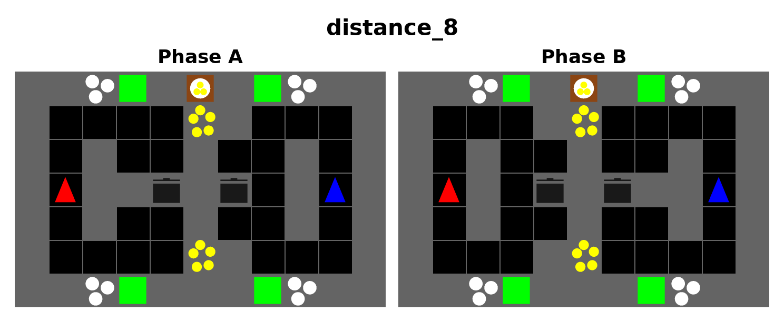
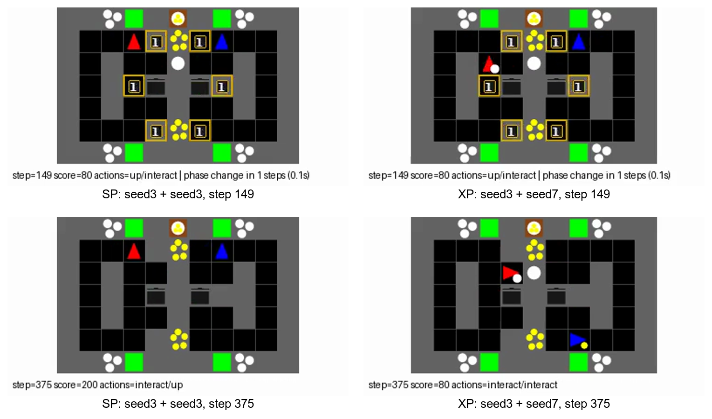

# `distance_8` 행동 확인

30M-step IPPO-RNN 10시드의 20-episode ordered-pair 평가에서 SP 10쌍은 모두
240점, XP 90쌍의 평균은 227.33점이었다. XP 중 63쌍도 240점이었고, 나머지는
220점 18쌍, 200점 3쌍, 180점 2쌍, 160점 1쌍, 100점 1쌍, 80점 2쌍이었다.
평균 차이 12.67점은 일부 큰 실패가 주도한다.

평가와 같은 결정적 정책·시드 0으로 재생한 `seed3 + seed3` SP는 240점,
`seed3 + seed7` XP는 80점이었다. 149스텝에는 두 조합 모두 위쪽 경로에
있었고, 누적 점수도 80점이었다. 150스텝의 역할 전환 뒤 SP 두 에이전트는
위쪽에 남아 생산을 계속했다. XP에서는 오른쪽 에이전트가 아래쪽으로 옮겨
150–224스텝 중 72스텝을 아래에 보냈지만 왼쪽 에이전트는 75스텝 모두
위쪽에 있었다. XP 점수는 에피소드 끝까지 80점에 머물렀다.

영상: [SP seed3+seed3](../../artifacts/layouts/handoff_convention_0924/rendered_distance_8/rnn_s3_sp.mp4),
[XP seed3+seed7](../../artifacts/layouts/handoff_convention_0924/rendered_distance_8/rnn_s3_s7_xp.mp4).

따라서 **경로 선택 불일치가 XP 생산 중단을 만들 수 있다**는 설계 의도는
관찰됐다. 다만 이 한 조합과 전체 점수만으로 경고를 읽고 미리 이동하는
정책이 학습됐다고 말할 수는 없다. SP 예시는 고정된 위쪽 관습을 유지했고,
XP의 경로 분기는 전환 후에 나타났다. 같은 체크포인트의 경고 제거 평가로
전환 예고의 기여를 별도로 확인한다. FCP 4시드에서는 SP와 XP가 모두
220점이었고 관습 불일치 효과가 나타나지 않았다.
