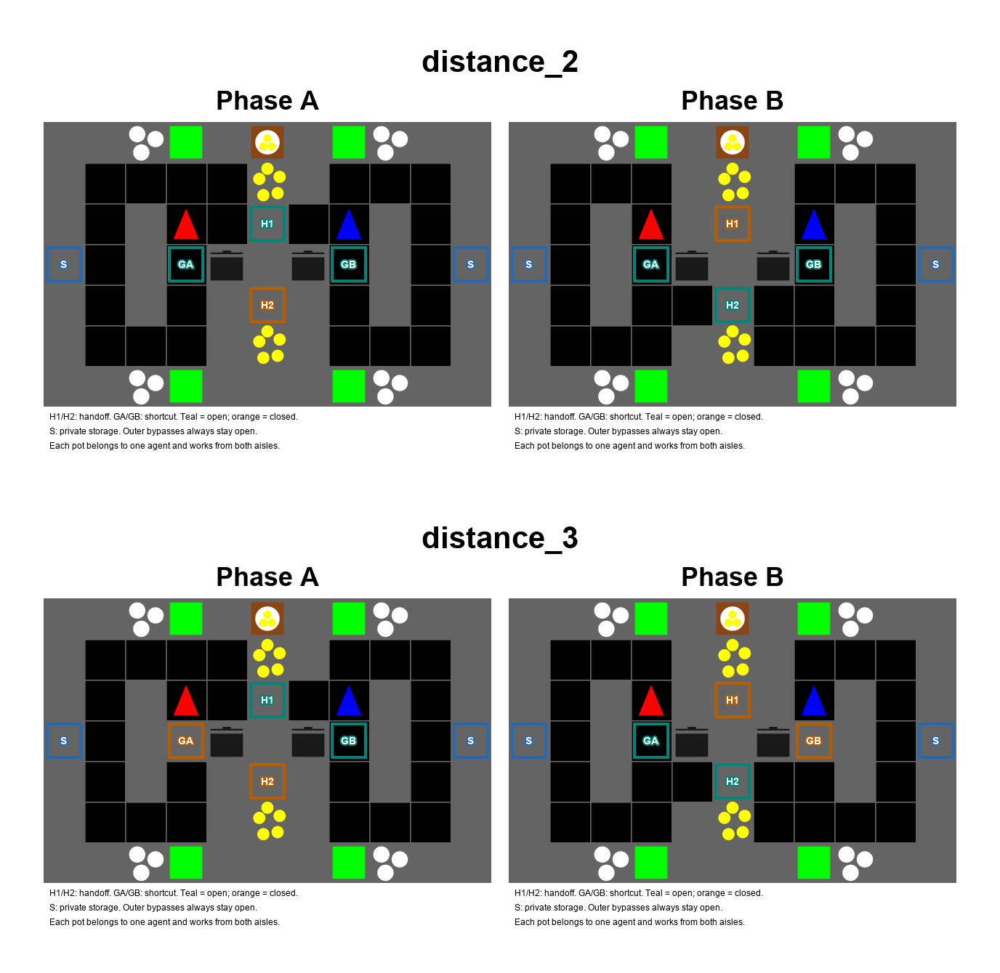

# Compact v4: 11×7, 두 맵, 알고리즘별 10 seeds

기존 7번→2번, 8번→3번으로 재지정했다. 이전 2/3 후보는 legacy 이름으로 보존한다.
IPPO-CNN은 실행 대상에서 제외했다. 현재 실험 후보는 `distance_2`과 `distance_3`의 **11×7 v4**다.
15×9 v3보다 면적을 135→77칸, 약 43% 줄였다. 큰 방 대신 각 주방의
3칸짜리 세로 장애물을 위·아래로 돌아가는 우회 통로를 사용한다.

| 맵 | 공통 전환 | 차이 |
| --- | --- | --- |
| distance_2 | A: 위쪽 A→B 공급, B: 아래쪽 B→A 공급 | 두 지름길 항상 열림 |
| distance_3 | 같은 공급자·전달 위치 전환 | 다음 공급자 쪽 지름길이 전환 시 닫힘 |

각자 pot 하나는 자기 주방의 위/아래에서 쓸 수 있으며 상대는 접근할 수 없다.
양파 source·전달대·접시·서빙 위치는 phase 사이에 고정된다. 개인 저장 칸은
하나씩이다. Station을 옮기거나 물건을 삭제하는 대신 접근 통로가 바뀐다.
활성 전달대 옆에서 자기 pot에 재료를 넣을 수 있어 정상 생산 동선은 짧다.



H1/H2는 전달대, GA/GB는 지름길, S는 개인 저장 칸이다.
청록은 열림, 주황은 닫힘이며 바깥 우회로는 항상 열려 있다.

## 정적 경로 계산

양방향 전환의 새 공급자를 기준으로 실제 바닥 그래프의 최단경로를 계산했다.

| 비용 | 2번 | 3번 |
| --- | ---: | ---: |
| 전환 전 구역 이동 | 2 | 2 |
| 전환 후 구역 이동 | 2 | 10 |
| 준비 완료 후 첫 양파를 새 전달대까지 가져오는 전환 후 이동 | 3 | 3 |
| 준비 없이 첫 양파를 새 전달대까지 가져오는 이동 | 5 | 11 |
| 준비 이동까지 포함한 첫 양파 공급의 총 이동 절약 | 0 | 6 |

3번의 구역 이동은 5배 차이다. 첫 양파 공급은 준비 시 **2+3=5칸**, 미준비 시
**11칸**이다. 우회 중 source에 먼저 도착할 수 있으므로 단순히 10+3으로 더하지
않고 전체 경로를 별도로 계산했다. 한편 재료 획득 없이 새 handoff 접근 칸에
도달하는 작업의 총 절약은 8칸이다. 두 작업의 비용을 혼동하지 않는다.

측정 시작은 A→B의 새 공급자 B (7,2), 준비 대기 위치 (7,4), source (6,5),
handoff 접근 칸 (6,4)다. B→A는 새 공급자 A (3,4)→대기 (3,2), source (4,1),
handoff 접근 칸 (4,2)다. 모두 0-based (x,y)다. 시작/대기 칸은 전환 중에도
바닥으로 유지된다. 방향 전환·interact·대기·조기 이동의 생산 기회비용은 제외했다.

이 값은 정적 기하 분석이며 학습된 agent의 성능 결과가 아니다. 실제 시작 위치,
이미 조리 중인 pot, inventory에 따라 reward drop이 달라질 수 있다. 고정 주기
암기, 닫히는 gate 위 agent의 기존 위치 보정, 단일 pot만 쓰는 정책 가능성도
남아 있다. 이를 해결했다고 주장하지 않는다.

## 실행할 수량

| 단계 | 맵 | 알고리즘별 learner seeds | 별도 FCP population |
| --- | --- | --- | --- |
| 예비 학습 | 2, 3 | 1개: seed 0 | 맵당 2개: 100, 101 |
| 본실험 | 2, 3 | 10개: 0–9 | 맵당 6개: 100–105 |

- 알고리즘은 IPPO-RNN, FCP-RNN이다.
- 모든 run은 30M steps. 본실험 learner **40 runs**와 population **12 runs**, 총 **52 runs**다.
- Population은 각 policy의 10/50/100% snapshots를 사용해 맵당 18 partner checkpoints를 만든다.
- 예비 학습은 learner 4 runs + population 4 runs = 8 runs로 별도다.
- 본 평가: 알고리즘 내 10×10 ordered seed pairs, pair당 20 episodes.
  두 맵·두 알고리즘 합계 **8,000 episodes**이며 대각선 SP와 나머지 XP를 구분한다.
- Observer agent_0, 450-step episode, 75-step phase, 경고 20 step, 양파 3개 recipe를 유지한다.

사용자가 H100 4장 확보와 HPC의 9/24 16–17시 가용 예정 정보를 제공해 본학습을
10 learner seeds로 확대했다. FCP population은 맵당 6 seeds를 유지한다. 이 population을
공유하는 10 best-response seeds이며, 서로 독립된 population 10개를 뜻하지 않는다.

기존 H100 30M 기록은 RNN 31–35분, FCP 35–39분이었다. 계획에는 RNN/population
45분, FCP 55분을 써 본학습 총 42시간 20분의 H100 GPU 시간을 배정한다
(20 RNN + 12 population + 20 FCP). H100 4장만으로도 학습 단계 약 11시간 분량이며
별도 pilot, 평가, 분석, 재실행은 추가다. 이 값은 새 맵의 실측값이 아니다.

H100에서는 예비 학습 후 population→FCP를, HPC에서는 가용해진 뒤 IPPO-RNN을
수행하는 분담을 계획한다. HPC를 H100과 같은 속도로 가정하지 않는다. 각 호스트가
담당 알고리즘의 완료 checkpoint를 평가하며 GPU 작업을 중복 실행하지 않는다.
전면 cross-play는 4-seed 계획보다 6.25배인 8,000 episodes이므로 평가가 주요
불확실성이다. 학습은 오늘 밤~내일 새벽 완료를 목표로 하고, 9/25 14:00 KST까지
평가·분석을 마치는 목표를 유지하되 pilot 처리량과 HPC 실제 가용 시점으로 ETA를
갱신한다. 원격 실행은 아직 시작하지 않았다.

## 파일 및 실행 상태

Runner는 `scripts/run/run_topology_inversion.sh`, 기본 campaign은
`handoff-site-0924-v4-d23-seed10`다. 2/3 config revision도 11×7 v4로 갱신했다.
이전 v1–v3 checkpoint·그림·비용 수치를 현재 결과와 섞지 않는다.

```bash
GPUS="1 5 6 7" bash scripts/run/run_topology_inversion.sh pilot train
GPUS="1 5 6 7" bash scripts/run/run_topology_inversion.sh pilot eval
# 예비 학습 행동 확인 후, 각 호스트의 독립 checkout에서 실행한다.
# H100: FCP population + best response. GPU 번호는 시작 시 재확인한다.
ALGORITHMS="fcp" GPUS="1 5 6 7" bash scripts/run/run_topology_inversion.sh main train
ALGORITHMS="fcp" GPUS="1 5 6 7" bash scripts/run/run_topology_inversion.sh main eval
# HPC: IPPO-RNN. 아래 GPU 번호는 실제 할당에 맞춘다.
ALGORITHMS="rnn" GPUS="0 1 2 3" bash scripts/run/run_topology_inversion.sh main train
ALGORITHMS="rnn" GPUS="0 1 2 3" bash scripts/run/run_topology_inversion.sh main eval
```

정적 경로는 `scripts/overcooked_v3/measure_handoff_routes.py`로 계산하고
`artifacts/layouts/handoff_site_inversion_0924_v4_d23/route_costs.json`에 기록했다.
Native 렌더링과 정적 경로 계산은 실행했다. 학습·rollout 평가는 미실행이며
예비/본실험의 성공이나 완료를 보고한 것이 아니다.
