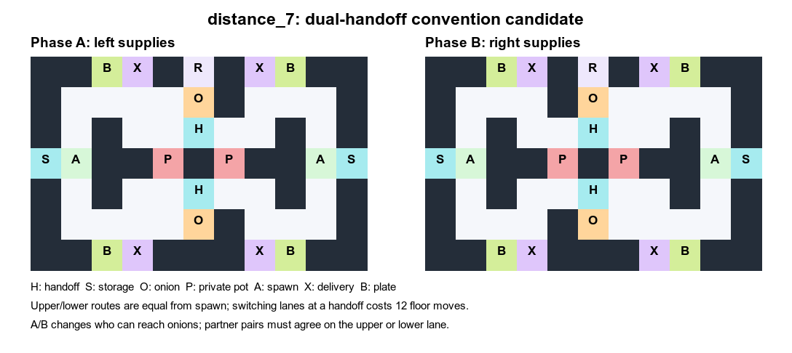

# 추가 후보 `distance_7`: 위/아래 전달 관습

기존 `distance_2/3`은 phase 전환 뒤 이동 비용과 reward drop을 만들지만,
FCP와 IPPO-RNN의 10-seed SP−XP 차이는 작다. 새 후보는 파트너와 합의해야 할
선택지를 맵에 만든다. 기존 두 맵의 데이터와 학습은 변경하지 않는다.



11×7 크기를 유지한다. 위·아래 두 개의 양파 공급 경로, 전달 counter, 접시와
서빙대는 각각 동등한 완전한 생산 경로다. 두 에이전트 모두 출발점에서 어느 쪽
전달 counter까지 6 floor moves다. 전달 지점에 도착한 후 반대 경로로 바꾸려면
바깥 우회로를 거쳐 12 floor moves가 필요하다. 경로 길이 계산은
`route_costs.json`에 보관하며 방향 전환, interaction, 다른 에이전트 점유는
제외한다.

Phase A에는 왼쪽 에이전트만 양파에 접근할 수 있어 A→B 공급이 필요하고,
phase B에는 오른쪽만 접근할 수 있어 B→A 공급이 필요하다. 각자의 pot은
공유하지 않는다. 전달 counter와 생산 설비는 이동하지 않고 양파 접근 경로만
바뀐다. 함께 학습한 파트너가 같은 위/아래 전달 관습을 택하면 짧은 루프를
유지하지만, 다른 시드의 파트너가 반대쪽에서 기다리면 우회나 재탐색 비용이 든다.

**SP>XP는 설계 가설이지 보장된 결과가 아니다.** 동일 알고리즘의 모든 시드가
같은 경로를 택하면 이 맵에서도 차이가 사라진다. 기존 CNN 평가와 예고 제거
진단까지 확인한 다음, 추가 맵이 필요할 때만 소규모 다중 시드 학습으로
위/아래 선택의 다양성, off-diagonal XP 손실, 전환 직후 reward drop을 확인한다.
그 근거가 있으면 10-seed 본실험으로 확장한다.

독립된 4-seed 확인 실행은 기존 campaign과 W&B project를 덮어쓰지 않도록
`handoff-convention-0924-d7-pilot4`를 사용한다. 기존 평가가 모두 끝나고
HPC GPU가 비었을 때 다음 명령을 실행한다. `SEED_IDS`는 0–3으로 제한하지만
각 run의 학습 길이는 본실험과 같은 30M steps다.

```bash
cd /home/jovyan/handoff-d23-seed10-0924
CAMPAIGN=handoff-convention-0924-d7-pilot4 LAYOUTS=distance_7 \
  SEED_IDS="0 1 2 3" ALGORITHMS=rnn GPUS="0 1 2 3" \
  bash scripts/run/run_topology_inversion.sh main train
CAMPAIGN=handoff-convention-0924-d7-pilot4 LAYOUTS=distance_7 \
  SEED_IDS="0 1 2 3" ALGORITHMS=rnn GPUS="0 1 2 3" \
  bash scripts/run/run_topology_inversion.sh main eval
```
