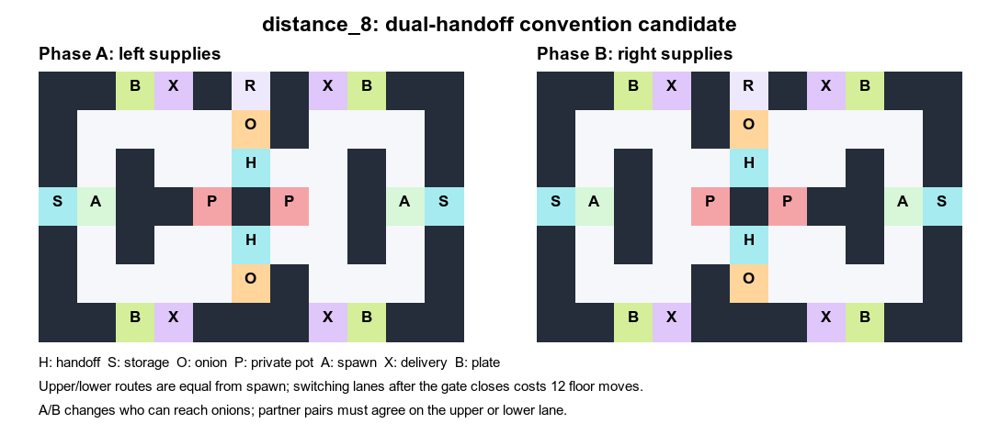

# `distance_8`: 전달 경로 선택의 전환 시한

`distance_7`의 4-seed IPPO-RNN 확인 실험은 SP 240, XP 233.33이었다. 정책
영상에서 seed 0은 주로 아래 전달 경로, seeds 1–3은 주로 위 경로를 썼지만,
XP 손실은 작았다. 경로 선택의 다양성만 늘리는 것으로는 충분하지 않다는
관찰을 바탕으로 `distance_8`을 만들었다.

크기는 동일한 11×7이다. 공급자와 전달 지점은 위·아래 두 경로에 대칭으로
놓여 있어 같은 경로에 합의한 팀은 기존의 짧은 생산 루프를 유지한다.
페이즈 A에서 다음 공급자인 오른쪽의 위/아래 연결 지름길은 열려 있고,
페이즈 B에서 닫힌다. 반대 방향 전환에서는 왼쪽이 같은 변화를 겪는다.
다음 공급자가 전달 지점 가까이에서 경로를 바꾸는 최소 floor 이동은
전환 전 **4칸**, 전환 후 **12칸**이다. 경로 측정은
`route_costs_distance_8.json`에 보관하며 상호작용·방향·다른 에이전트
점유는 포함하지 않는다.

이 설계는 파트너가 어느 전달 경로를 쓸지 일찍 읽고 다음 페이즈에 맞춰
이동한 SP 팀이 생산량을 지키도록 의도했다. XP 파트너가 다른 경로를
선호하거나 늦게 전환하면 8칸 이상의 추가 이동을 치른다. 실제 학습된
정책이 이 상황을 만들고 SP 점수를 유지하는지는 별도 4-seed 학습 및
cross-play 평가로 검증한다. 결과가 부족하면 10-seed로 확대하지 않는다.
