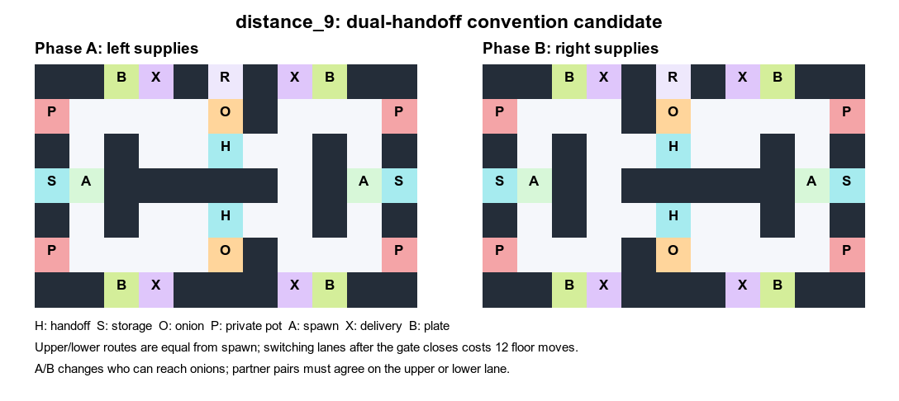

# `distance_9`: 전달 경로마다 독립된 조리 루프

`distance_8` 4-seed 평가에서 IPPO-RNN은 SP 240, XP 228.33이었지만 FCP는
SP와 XP가 모두 220이었다. FCP의 4×4 조합은 거의 모두 220으로, 경로가 달라도
중앙 냄비 하나에서 두 전달대를 처리할 수 있는 구조가 불일치를 흡수했을
가능성이 있다. 이 원인은 아직 정책 행동 분석으로 확정되지 않았다.

`distance_9`는 11×7 크기와 양방향 역할 교대, 위·아래 공유 전달대를 유지한다.
양쪽 중앙 냄비를 벽으로 바꾸고, **각 에이전트의 구역 안에 위·아래 전용 냄비를
하나씩** 둔다. 상대 냄비는 여전히 접근할 수 없다. 같은 전달 경로를 택한 팀은
그 경로의 냄비·접시·서빙대로 이어지는 짧은 생산 루프를 쓸 수 있다. 반대
전달대에서 기다린 요리사는 냄비까지 생산 루프를 바꿔야 한다. 역할 전환 뒤
공급자의 전달대 간 우회는 12 floor 이동이며, 전환 전에는 4 이동이다.
측정값은 `route_costs_distance_9.json`에 있다. 이동값에는 상호작용과
에이전트 간 점유가 포함되지 않는다.

이 후보는 FCP와 IPPO-RNN을 각각 4 learner seed로 먼저 학습하고 4×4
순서쌍을 평가한다. 절대 SP가 유지되고 XP가 낮아지는지 확인한다. 냄비
분리만으로 정책별 경로 선택이 달라지는 것은 보장되지 않으므로, 평가에서
SP–XP 차이가 없거나 SP 자체가 크게 떨어지면 10-seed로 확대하지 않는다.
