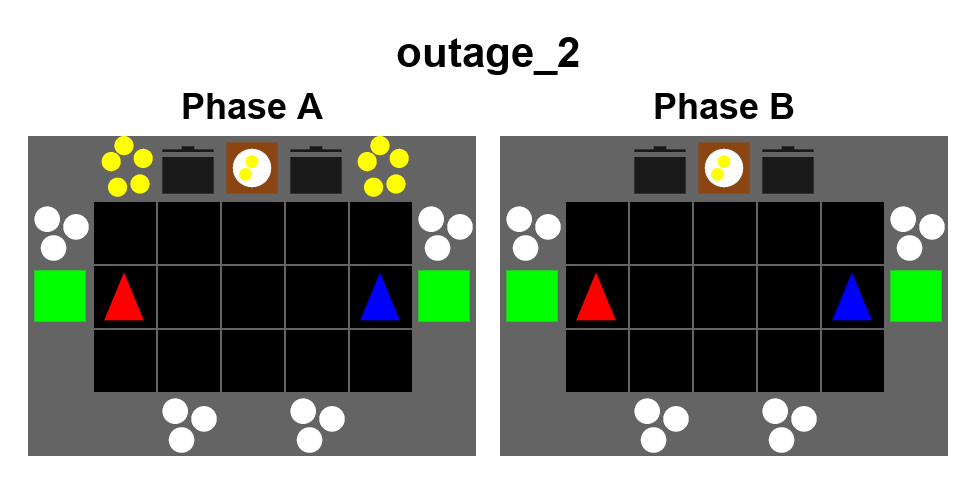
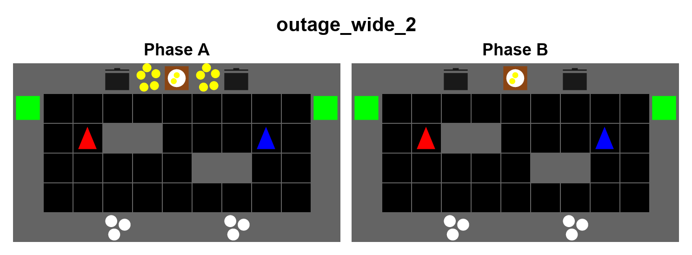
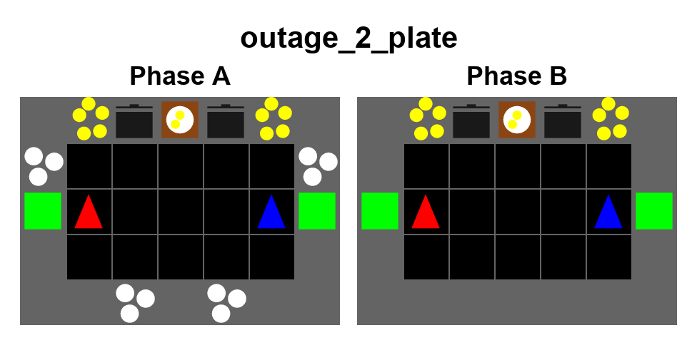
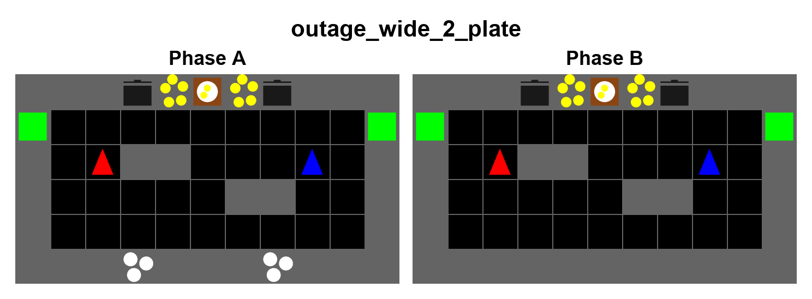

# Shared-room resource outage, variant 2

The entire walkable kitchen is connected in every phase. Both agents can reach
every station. The normal map retains the footprint, boundary stations and
spawns of `outage_0`, with its central divider removed. Wide revision v2 reduces
the width from 13 to 11 columns while keeping six rows. Its two staggered
two-cell obstacles at (3, 2)/(4, 2) and (6, 3)/(7, 3), using zero-based (x, y),
create detours while leaving the central aisle and outer routes connected.
These `N` obstacles cannot store objects. Wide spawns are (2, 2) and (8, 2).
Resource counts, the two-onion recipe, and cooking time remain unchanged.

| Configuration / layout | Size (width × height) | Missing in phase B |
| --- | --- | --- |
| `outage_2` | 7 × 5 | Every onion dispenser |
| `outage_wide_2` | 11 × 6 | Every onion dispenser |
| `outage_2_plate` | 7 × 5 | Every plate dispenser |
| `outage_wide_2_plate` | 11 × 6 | Every plate dispenser |

Phase A lasts steps 0–149. Phase B starts at step 150, replacing every dispenser
of the selected resource with a counter. At step 300 the original stations
return; standard episodes finish at step 450. The underlying recovery phase
retains the existing 1,000-step duration.

This changes the coordination problem from cross-room supply to preparation:
collect and store the resource before the outage, then ration the stock while
cooking and serving together. There is no surviving dispenser elsewhere on the
map. Outage means zero **new supply**, not deletion of existing inventory:
items on unchanged counters, carried items, and pot contents survive. Items put
on a disabled dispenser's counter are cleared when that dispenser returns, as
with all changed cells in V3. The wide map provides longer travel routes and
more boundary storage. Performance and difficulty have not been measured.

## Onion outage





## Plate outage





Recreate the native environment previews with:

```sh
PYTHONPATH=. .venv/bin/python scripts/overcooked_v3/render_shared_room_outage.py \
  --layouts outage_2 outage_wide_2 outage_2_plate outage_wide_2_plate \
  --output-dir docs/overcooked_v3/shared_room_outage --tile-size 64
```

Select the matching scenario name in existing Hydra training/evaluation entry
points, e.g. `+scenario=outage_2` (or `scenario=outage_2` if already configured).
