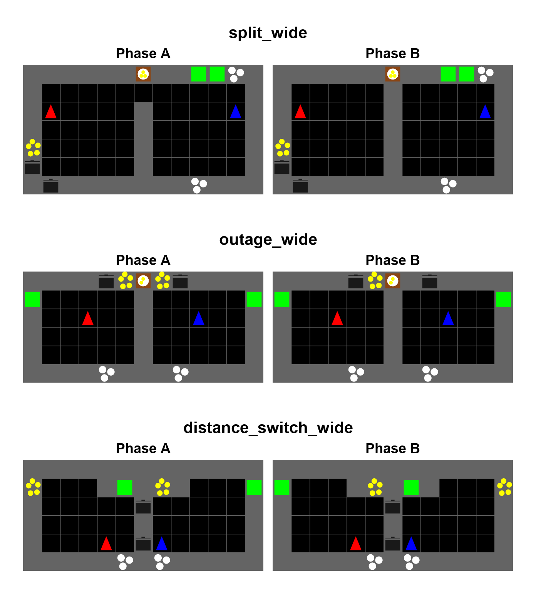

# Wide role-scenario maps

기본 `_0` 맵의 설계 동기를 유지하면서 가로를 13칸으로 확장한 세 맵이다.
Split은 원래 높이를 유지하고 Outage/Distance Switch는 세로를 한 칸 늘렸다.
좌우 작업 공간과 중앙 구분선의 대칭을
위해 가로 길이를 홀수로 정했다.

| Scenario | 기존 → wide (가로×세로) | 면적 비율 | Hydra scenario |
| --- | --- | --- | --- |
| Split | 9×7 → 13×7 | 1.44× | `split_wide` |
| Outage | 7×5 → 13×6 | 2.23× | `outage_wide` |
| Distance Switch | 9×5 → 13×6 | 1.73× | `distance_switch_wide` |

현재 revision은 `split-wide-v3`, `outage-wide-v3`,
`distance-switch-wide-v2`다. 아래쪽 경계의 자원은 새 경계로 옮기고,
Outage의 추가 행에는 non-storage divider를 두어 handoff 두 칸을 유지한다.

세 맵 모두 A → B → A 순서이며 150, 300 step에 전환한다.
Hydra 설정의 episode 길이는 450 step이다. 기존 맵과 마찬가지로 마지막 A의
layout duration은 1000으로 두어 episode 종료 전 추가 전환을 막는다.
조리시간은 20 step이며 Split/Distance Switch는 양파 3개, Outage는 2개를 쓴다.
자원 개수는 각 `_0`와 같다. 넓어진 이동 공간 때문에 실제 처리량과 난이도는
학습 및 평가로 별도 확인해야 한다.

## Split: 역할 형성

왼쪽의 양파 1곳·pot 2개, 오른쪽의 plate 2곳·serving 2곳을 유지한다.
중앙 위쪽 문 `(6, 1)`이 150 step에 handoff counter로 바뀌며 두 bay가
분리된다. 닫힌 뒤에도 요리를 완성하려면 서로 반대편에 자리 잡고
cook–server 역할을 분담해야 한다. 넓어진 각 bay는 이동 부담을 늘리지만,
역할별 자원을 한쪽에 모으는 원래의 상호 의존성은 유지한다.

## Outage: 자원 재분배

두 bay는 항상 분리되어 있고 각각 onion·pot·plate·serving을 한 곳씩 갖는다.
150 step에 오른쪽 onion `(7, 0)`이 counter로 바뀐다. 오른쪽 cook은
남은 왼쪽 onion에 직접 걸어갈 수 없어 왼쪽 cook의 공급이 필요하다.

공간만 늘리다가 협력이 지나치게 비싸지는 것을 피하기 위해 onion과 pot은
중앙 가까이에 배치했다. 왼쪽 onion `(5, 0)`과 위쪽 handoff `(6, 1)`은
같은 바닥 `(5, 1)`에서 접근할 수 있어 전달 전 이동이 0 step이다.
오른쪽은 handoff를 받는 `(7, 1)`에서 pot 앞 `(8, 1)`까지 1 step이다.
아래쪽 handoff `(6, 2)`도 유지해 양파 2개를 미리 적재할 수 있다.
넓어진 바깥쪽에 serving을 두어 local cooking과 상대편 공급 사이의 선택을
유지한다. 위의 거리는 회전·상호작용을 제외한 movement 거리다.

## Distance Switch: 역할 재배정

중앙 pot 2개와 아래쪽 plate 2곳을 고정하고, 양쪽 bay의 가까운/먼
onion·serving endpoint 타입을 150 step에 맞바꾼다.
각 agent는 자기 bay에서 모든 종류의 station에 계속 접근할 수 있다.
A에서는 agent 0이 serving, agent 1이 onion input에 유리하고 B에서는 반대다.

가로 확장으로 가까운/먼 경로의 차이를 늘리면서 같은 비교 우위 구조를
보존했다. 정의 파일의 기존 경로 검증기는 이 맵에도 적용되어 두 phase의
이동 영역 불변, 자원 접근성, 최소 3 movement step의 역할별 우위 반전을
요구한다.

## 사용 및 미리보기

기존 학습 명령에서 `scenario=split_wide`, `scenario=outage_wide`,
`scenario=distance_switch_wide`를 지정하면 된다. 각 설정은
`LAYOUT_REVISION`을 기록한다. 기본 sweep의 맵 목록은 그대로이며 wide를
포함하려면 해당 sweep의 scenario 목록에 추가한다.
role-scenario catalog에 등록되어 rollout CLI와 phase-policy layout 생성에서도
사용할 수 있다.

그림은 다음 명령으로 생성한다.

```bash
.venv/bin/python scripts/overcooked_v3/render_observer_layouts.py --wide --tile-size 48
```



좌표는 왼쪽 위가 `(0, 0)`인 `(x, y)` 표기다.
