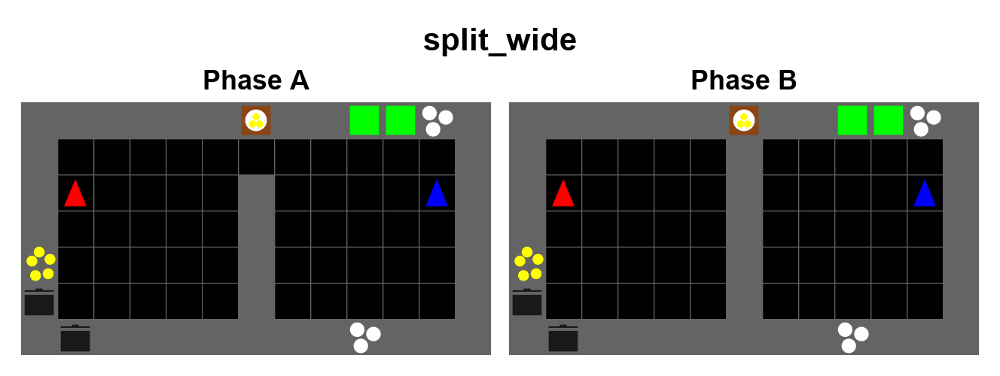
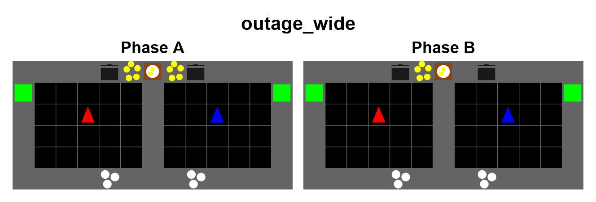
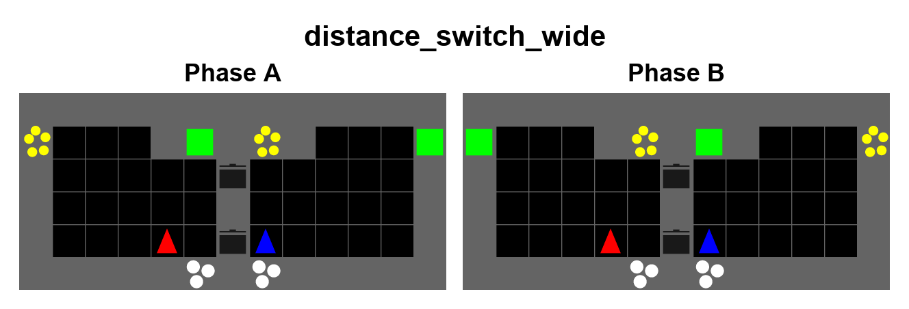

# Wide role-scenario maps

| Hydra scenario | Width × height | Revision | Mechanism |
| --- | --- | --- | --- |
| `split_wide` | 11×7 | `split-wide-pillars-edges-v3` | The central doorway closes; opposite-edge cooking and serving stations require coordinated handoffs. Two interior obstacles create detours. |
| `outage_wide` | 11×6 | `outage-wide-shared-room-v2` | Every onion dispenser disappears during phase B in a shared room with staggered obstacles. |
| `distance_switch_wide` | 13×6 | `distance-switch-wide-v2` | Onion and serving locations exchange near/far advantages while pots and plates stay fixed. |

All three maps alternate A and B every 75 steps. Transitions occur at steps 75,
150, 225, 300, and 375 in a 450-step episode. Outage uses two onions per soup;
Split and Distance Switch use three. These layouts can be selected directly
without changing default sweeps. Historical aliases remain registered for old
checkpoints and experiment records.

```bash
python baselines/IPPO/ippo_overcooked_v3.py scenario=split_wide ARCHITECTURE=rnn
python baselines/IPPO/ippo_overcooked_v3.py scenario=outage_wide ARCHITECTURE=rnn
python baselines/IPPO/ippo_overcooked_v3.py scenario=distance_switch_wide ARCHITECTURE=rnn
```

The published `split_wide` is the selected 11×7 pillars map. Historical runs
named `split_wide` with `split-wide-v3` used a different map. Always filter
experiment results by layout revision as well as layout name.

## Phase previews






